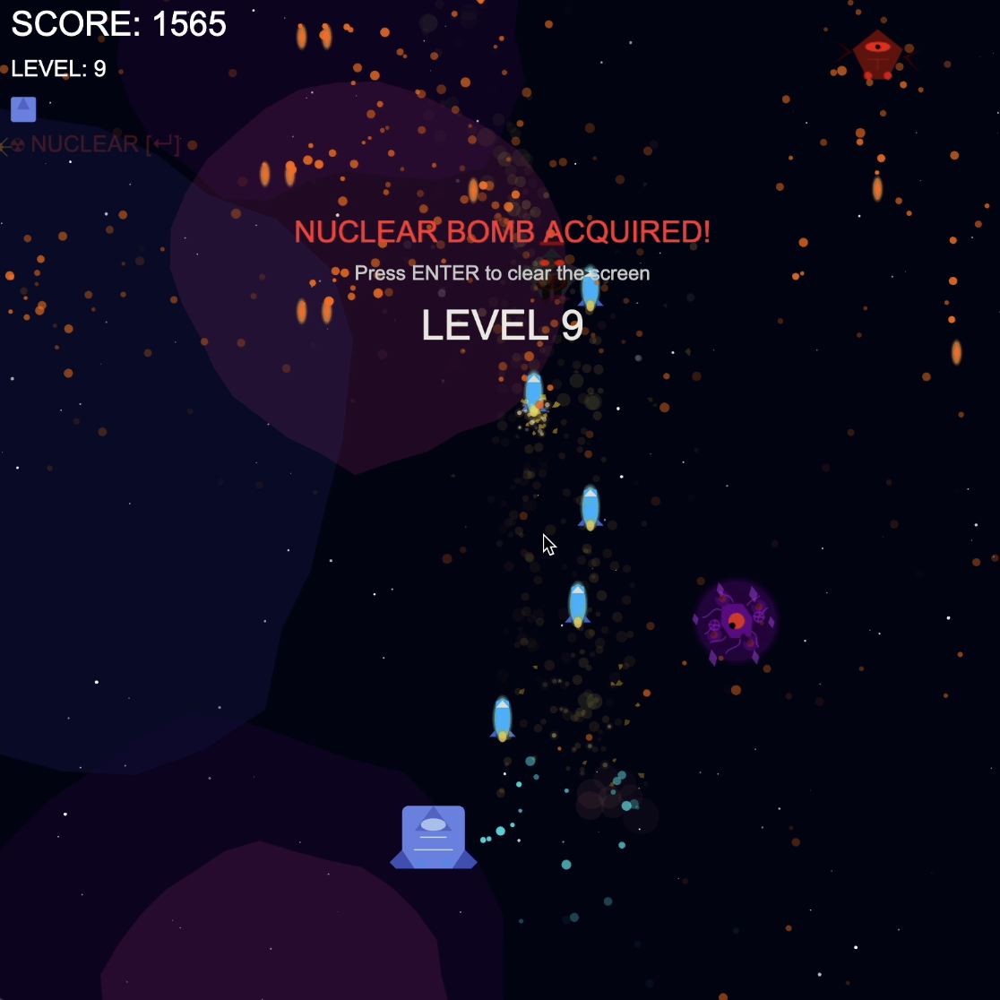

# 🚀 Space Shooter 🎮 [Play Now!](https://bibryam.github.io/space-shooter)



## ✨ Features

- 🚀 Smooth, responsive ship controls
- 💥 Beautiful particle effects and explosions
- 🛡️ Power-ups system (shields and nuclear bombs)
- 👾 Progressive difficulty with challenging boss battles
- 🌌 Dynamic background with nebula effects
- 🎯 Score tracking and level progression
- 🔊 Immersive sound effects
- 🏆 Social sharing for high scores

## 🎮 Controls

- **Move**: Arrow keys or WASD
- **Shoot**: Space bar or left mouse click
- **Nuclear Bomb**: ENTER key (when available)
- **Share Score**: 'S' key (after game over)

## 🚀 Running Locally

1. Clone the repository:
```bash
git clone https://github.com/bibryam/space-shooter.git
cd space-shooter
```

2. Serve the files using a local web server. You can use Python's built-in server:

```bash
# Python 3.x
python -m http.server

# Python 2.x
python -m SimpleHTTPServer
```

3. Open your browser and navigate to `http://localhost:8000`

## 🛠️ Technologies Used

- HTML5 Canvas
- p5.js for graphics and game logic
- JavaScript ES6+
- CSS3 for styling

## 🤝 Contributing

Contributions are welcome! Feel free to submit issues and pull requests.

1. Fork the repository
2. Create your feature branch (`git checkout -b feature/AmazingFeature`)
3. Commit your changes (`git commit -m 'Add some AmazingFeature'`)
4. Push to the branch (`git push origin feature/AmazingFeature`)
5. Open a Pull Request

## 📝 License

This project is licensed under the MIT License - see the [LICENSE](LICENSE) file for details.

---
Made with ❤️ by [bibryam](https://github.com/bibryam) 
